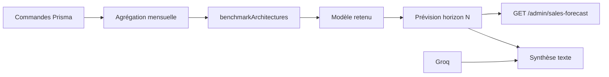

# ML — architectures et sélection automatique

## Vue d’ensemble

Le module `backend/ml/` gère la **prévision du chiffre d’affaires** (admin) sans service Python obligatoire. Plusieurs **architectures** sont entraînées et comparées automatiquement ; la meilleure (MAPE sur hold-out) alimente l’API `/api/ai/admin/sales-forecast`.



## Architectures testées

| ID | Description |
|----|-------------|
| `linear_regression` | Régression OLS sur l’indice temporel |
| `moving_average` | Moyenne mobile (fenêtre adaptative) |
| `exponential_smoothing` | Lissage exponentiel simple (α=0,35) |
| `holt_linear_trend` | Holt niveau + tendance |
| `naive_last` | Dernière valeur observée |
| `naive_average` | Fallback si historique &lt; 2 points |

## Sélection automatique

1. Découpage **train / validation** (hold-out = min(3, ⌊n/4⌋)).
2. Chaque architecture est ajustée sur le train et évaluée sur la validation.
3. Classement par **MAPE** (puis R² en cas d’égalité).
4. Réajustement du gagnant sur **toute** la série → prévisions futures.

Fichiers clés :

- `ml/architectures.js` — définitions des modèles
- `ml/autoSelect.js` — benchmark + `forecastWithAutoModel`
- `services/salesForecast.service.js` — pipeline métier + Groq
- `services/mlBenchmark.service.js` — API benchmark admin

## Autres « modèles » du projet

| Composant | Type | Fichier |
|-----------|------|---------|
| Recommandations produits | Scoring règles + profil animal | `petRecommendation.service.js` |
| Agent IA client | Groq + scoring | `aiRecommendationAgent.service.js` |
| NutriPro / vision | FastAPI optionnel (`:8000`) | `fastapi_service/` (gitignored) |
| Santé par espèce | Règles catalogue | `healthRecommendations.service.js` |

## Commandes

```bash
cd backend
npm run test:ml          # tests unitaires architectures
npm run ml:benchmark              # rapport console (série synthétique, sans DB)
npm run ml:benchmark -- --live    # benchmark sur commandes Prisma (DB requise)
```

## API admin

| Route | Description |
|-------|-------------|
| `GET /api/ai/admin/sales-forecast` | Prévision + `modelBenchmark` |
| `GET /api/ai/admin/ml-benchmark` | Classement des architectures |
| `GET /api/ai/admin/ml-benchmark?full=1` | Benchmark + prévision production |

Réponse type `modelBenchmark` :

```json
[
  { "id": "holt_linear_trend", "label": "Holt (tendance linéaire)", "mape": 4.2, "rmse": 120, "r2": 0.91, "rank": 1, "selected": true }
]
```

## Suite plateforme (`POST /ml/platform/insights`)

| Cas d'usage | Modèle | Sortie |
|-------------|--------|--------|
| CA mois prochain | XGBoost séries | `nextMonthRevenue` |
| Demande par produit | XGBRegressor par SKU | `productDemand[]` |
| Client rachètera ? | XGBClassifier | `churnPredictions[]` |
| Risque annulation | XGBClassifier | `cancelRiskOrders[]` |
| Ranking chien senior | XGBoost + règles | `seniorDogRanking[]` |
| Fraude | Isolation Forest | `anomalyDetection.fraudAlerts` |
| Pic commandes | Z-score journalier | `anomalyDetection.volumeSpikes` |

API admin Node : `GET /api/ml/admin/insights`  
API admin commandes : `GET /api/ml/admin/orders-risk`  
API client pack IA : `GET /api/ml/client/pack` (Groq + XGBoost + reco)  
API client ranking : `GET /api/ml/rank/senior-dog?petId=…`

## XGBoost (Python / FastAPI)

Service : `fastapi_service/` (port **8000**).

| Variable | Description |
|----------|-------------|
| `ML_SERVICE_URL` | URL FastAPI (défaut `http://127.0.0.1:8000`) |
| `ML_USE_XGBOOST` | `true` = appeler Python si ≥ 5 mois d'historique |
| `ML_TIMEOUT_MS` | Timeout HTTP (défaut 8000) |

```bash
cd fastapi_service && pip install -r requirements.txt
npm run dev:ml          # depuis la racine frontend
npm run dev:full        # Vite + backend + ML
```

Si Python est arrêté, le backend utilise automatiquement `backend/ml/` (Node).

## Étendre le module

1. Ajouter un objet dans `ARCHITECTURES` (`fit`, `predict`, optionnel `residualStd`).
2. Lancer `npm run test:ml` — la sélection automatique l’inclura.
3. Vérifier le dashboard admin (libellé via `modelLabel`).
